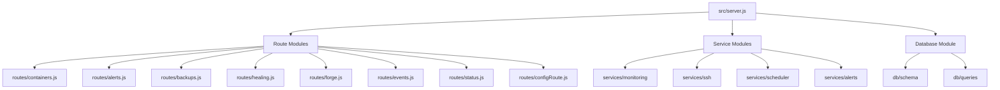
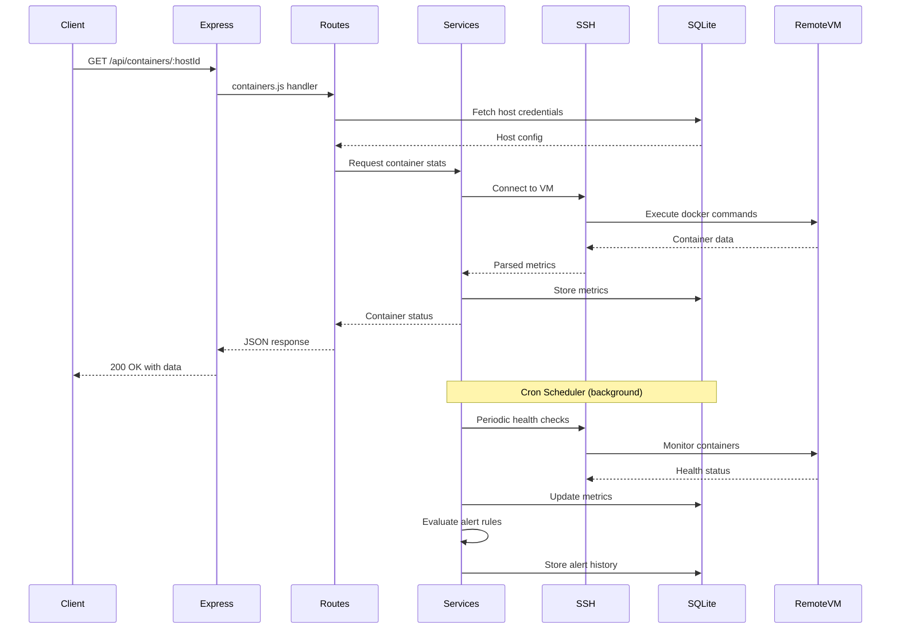
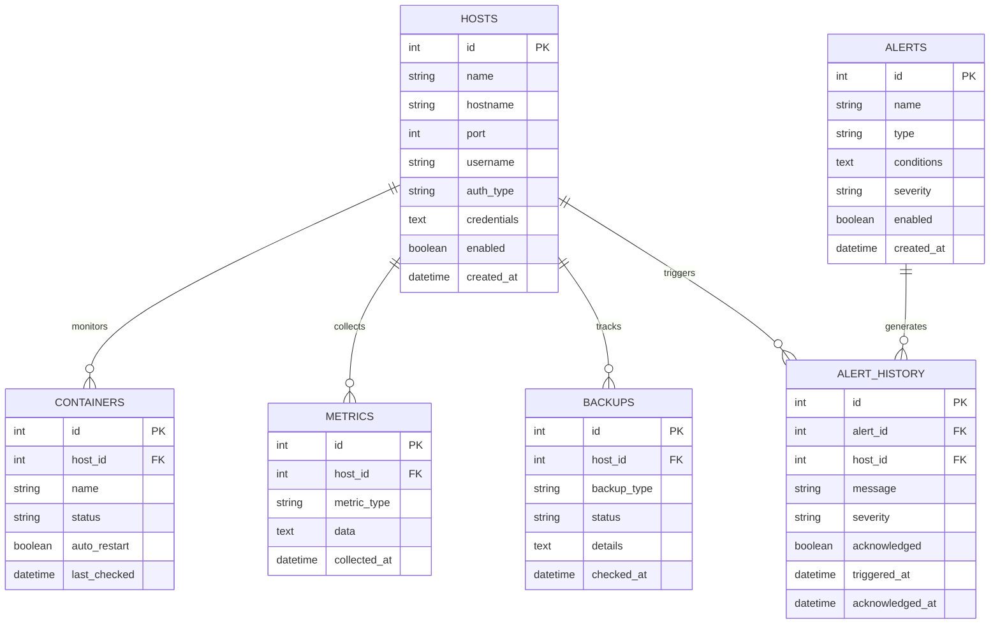

# ARCHITECTURE.md

## Table of Contents

- [ARCHITECTURE.md](#architecturemd)
  - [Overview](#overview)
  - [System Architecture](#system-architecture)
  - [Component Tree](#component-tree)
  - [Data Flow](#data-flow)
  - [Database Schema](#database-schema)
  - [Directory Structure](#directory-structure)
  - [Design Decisions](#design-decisions)
    - [1. **Express.js Framework**](#1-expressjs-framework)
    - [2. **SQLite Database**](#2-sqlite-database)
    - [3. **SSH-Based Agent-less Monitoring**](#3-ssh-based-agent-less-monitoring)
    - [4. **Cron-Based Scheduling**](#4-cron-based-scheduling)
    - [5. **Modular Route Structure**](#5-modular-route-structure)
    - [6. **RESTful API Design**](#6-restful-api-design)
  - [Dependencies](#dependencies)
    - [**better-sqlite3** (v11.0.0)](#better-sqlite3-v1100)
    - [**express** (v4.21.0)](#express-v4210)
    - [**node-cron** (v4.2.1)](#node-cron-v421)
    - [**ssh2** (v1.17.0)](#ssh2-v1170)
  - [Related Documentation](#related-documentation)

## Overview

Sentinel is an infrastructure monitoring and alerting system built with Express.js and Node.js that provides real-time visibility into TheForge ecosystem infrastructure. The application runs as a centralized monitoring hub on the Claudinator host (port 3000) and connects to remote VMs via SSH to collect metrics about Docker containers, system resources, services, and backup status. The architecture follows a modular design with separate route handlers for different monitoring domains (containers, alerts, backups, healing, events, forge tasks).

The system uses SQLite (via better-sqlite3) as its persistence layer to store host configurations, alert rules, historical data, and audit logs. A cron-based scheduler (node-cron) drives periodic monitoring tasks including container health checks, backup verification, metric collection, and alert evaluation. SSH2 enables secure remote command execution on monitored hosts to gather Docker and system statistics.

The application is designed for low-overhead monitoring with a simple REST API that can be consumed by frontend dashboards or other automation tools. All monitoring logic is server-side, eliminating the need for agents on monitored VMs.

## System Architecture

```mermaid
graph TD
    A[Express Server :3000] --> B[Route Controllers]
    A --> C[Monitoring Services]
    A --> D[Database SQLite]
    
    B --> B1[/api/containers]
    B --> B2[/api/alerts]
    B --> B3[/api/backups]
    B --> B4[/api/healing]
    B --> B5[/api/forge]
    B --> B6[/api/events]
    B --> B7[/api/status]
    B --> B8[/api/config]
    
    C --> C1[Cron Scheduler]
    C --> C2[SSH Client]
    C --> C3[Alert Engine]
    
    C1 --> C2
    C2 --> E[Remote VMs via SSH]
    C3 --> F[Alert Handlers]
    
    D --> G[Hosts Config]
    D --> H[Alert Rules]
    D --> I[Metrics History]
    D --> J[Audit Logs]
    
    C2 --> D
    C3 --> D
    B --> D
```

## Component Tree



## Data Flow



## Database Schema



## Directory Structure

```
sentinel/
├── src/
│   ├── server.js                 # Express app entry point
│   ├── routes/                   # API route handlers
│   │   ├── alerts.js            # Alert CRUD and history
│   │   ├── backups.js           # Backup status checks
│   │   ├── configRoute.js       # System configuration
│   │   ├── containers.js        # Docker container monitoring
│   │   ├── events.js            # System event log
│   │   ├── forge.js             # TheForge task tracking
│   │   ├── healing.js           # Self-healing stats
│   │   └── status.js            # Host status and metrics
│   ├── services/                # Business logic layer
│   │   ├── monitoring/          # Metric collection services
│   │   ├── ssh/                 # SSH connection management
│   │   ├── scheduler/           # Cron job definitions
│   │   └── alerts/              # Alert evaluation engine
│   ├── db/                      # Database layer
│   │   ├── schema.sql           # SQLite schema
│   │   └── queries.js           # Prepared statements
│   └── utils/                   # Shared utilities
├── data/                        # SQLite database files
├── logs/                        # Application logs
└── package.json
```

## Design Decisions

### 1. **Express.js Framework**
Chosen for its simplicity and minimal overhead. Sentinel is a monitoring tool that needs to be lightweight and reliable. Express provides just enough structure for REST APIs without framework bloat. The application can run on minimal resources while monitoring multiple VMs.

### 2. **SQLite Database**
Selected over PostgreSQL/MySQL because:
- No separate database server to maintain (eliminates a dependency)
- File-based storage is simple to backup
- Sufficient performance for monitoring data (not handling high-concurrency writes)
- Zero configuration required
- Perfect for single-node monitoring hub

### 3. **SSH-Based Agent-less Monitoring**
Rather than deploying agents on each monitored VM, Sentinel uses SSH to execute commands remotely. This approach:
- Reduces attack surface (no new services on VMs)
- Simplifies deployment (no agent installation)
- Leverages existing SSH infrastructure
- Allows monitoring any VM with SSH access
- Centralizes all monitoring logic in one place

### 4. **Cron-Based Scheduling**
node-cron provides a simple in-process scheduler for periodic tasks. This eliminates the need for external cron configurations or separate scheduler services. All monitoring intervals are defined in code and run within the Node.js process.

### 5. **Modular Route Structure**
Each monitoring domain (containers, alerts, backups, etc.) has its own route file. This separation:
- Makes the codebase easier to navigate
- Allows independent testing of features
- Enables team members to work on different domains without conflicts
- Follows single-responsibility principle

### 6. **RESTful API Design**
All functionality is exposed via REST endpoints rather than building a monolithic web UI. This allows:
- Frontend flexibility (any client can consume the API)
- CLI tool integration
- Automation via scripts
- Future mobile app development

## Dependencies

### **better-sqlite3** (v11.0.0)
Synchronous SQLite3 bindings with better performance than the async alternatives. Chosen because:
- Significantly faster than node-sqlite3 (synchronous I/O is fine for monitoring workloads)
- Native compiled module provides excellent performance
- Simple API with prepared statements
- No callback hell or promise chains for database queries
- WAL mode support for concurrent reads during writes

### **express** (v4.21.0)
Industry-standard web framework for Node.js. Selected for:
- Mature ecosystem with extensive middleware availability
- Excellent documentation and community support
- Lightweight and unopinionated design
- Built-in routing and middleware system
- Known stability (v4 has been battle-tested for years)

### **node-cron** (v4.2.1)
In-process cron scheduler for Node.js. Chosen because:
- Simple syntax matching traditional cron expressions
- No external dependencies (no need for system cron)
- Precise timing control for monitoring intervals
- Easy to manage multiple scheduled tasks
- Lightweight with minimal overhead

### **ssh2** (v1.17.0)
Pure JavaScript SSH2 client for Node.js. Selected for:
- Full SSH protocol implementation (auth, exec, sftp)
- No native dependencies (pure JS except optional crypto acceleration)
- Active maintenance and security updates
- Supports multiple authentication methods (password, key-based)
- Stream-based API for efficient command execution
- Essential for agent-less remote monitoring architecture
---

## Related Documentation

- [Readme](README.md)
- [Api](API.md)
- [Deployment](DEPLOYMENT.md)
- [Contributing](CONTRIBUTING.md)
