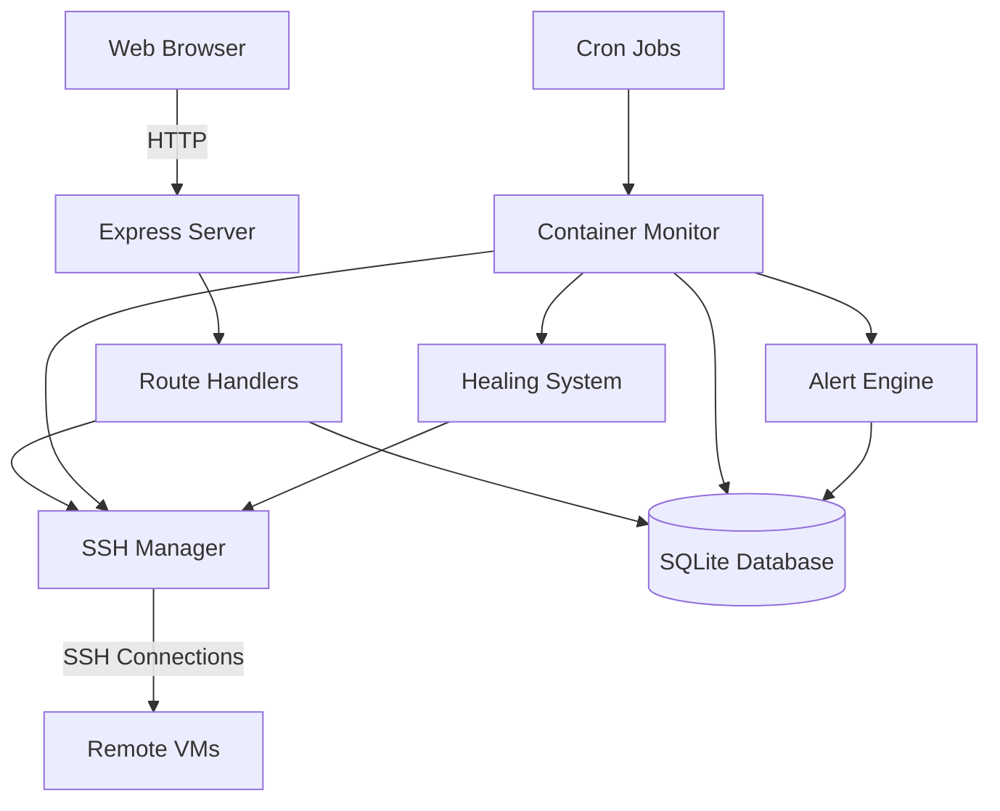
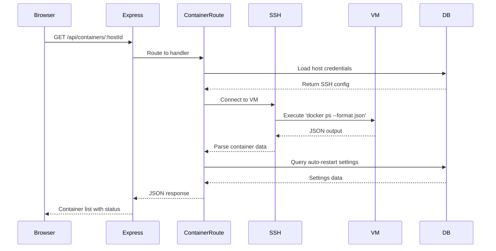
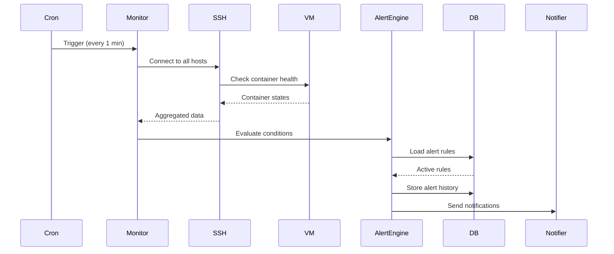
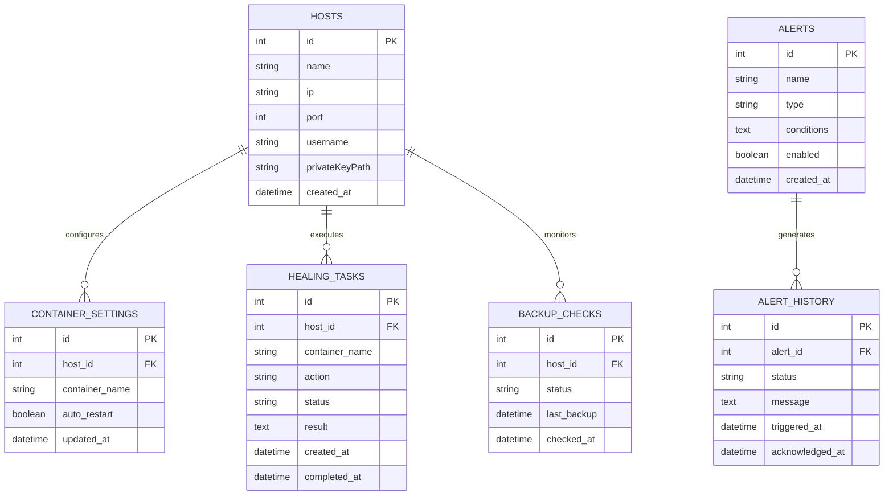

# ARCHITECTURE.md — Sentinel

## Table of Contents

- [ARCHITECTURE.md — Sentinel](#architecturemd-sentinel)
  - [How It Works](#how-it-works)
  - [System Overview](#system-overview)
  - [Data Flow](#data-flow)
    - [Container Status Check](#container-status-check)
    - [Alert Generation Flow](#alert-generation-flow)
  - [Database](#database)
  - [Project Structure](#project-structure)
  - [Key Design Decisions](#key-design-decisions)
  - [Related Documentation](#related-documentation)

## How It Works

Sentinel is an infrastructure monitoring dashboard that gives you real-time visibility into your entire server ecosystem. When you open the dashboard at `http://claudinator:3000`, here's what happens:

1. **Your browser loads the frontend** which immediately starts polling multiple API endpoints every few seconds
2. **The Express server** receives these requests and delegates them to specialized route handlers
3. **Each route handler** uses SSH connections (via the `ssh2` library) to reach into remote VMs and execute commands
4. **Remote commands** gather Docker container stats, system metrics, service status, and backup information
5. **Data flows back** through SSH → route handler → JSON response → browser
6. **Background cron jobs** run every minute to check for problems and generate alerts stored in SQLite
7. **The healing system** can automatically restart crashed containers when problems are detected

The system is "agentless" — instead of installing monitoring software on each VM, Sentinel SSHs from Claudinator into each machine and runs commands directly. This keeps the VMs clean but means Sentinel needs SSH credentials for every host.

The SQLite database stores persistent data: alert configurations, alert history, host registry, and healing task logs. Everything else is queried in real-time.

## System Overview



## Data Flow

### Container Status Check



### Alert Generation Flow



## Database



## Project Structure

```
sentinel/
├── src/
│   ├── server.js                 # Express app entry point, mounts all routes
│   ├── database.js               # SQLite initialization and schema setup
│   ├── config.js                 # Environment and app configuration
│   ├── routes/
│   │   ├── status.js            # Host registration and metrics endpoints
│   │   ├── containers.js        # Docker container listing and restart control
│   │   ├── alerts.js            # Alert CRUD operations and history
│   │   ├── backups.js           # Backup status checking across hosts
│   │   ├── events.js            # System event log aggregation
│   │   ├── forge.js             # TheForge orchestrator task monitoring
│   │   ├── healing.js           # Self-healing system stats and logs
│   │   └── configRoute.js       # Configuration endpoints
│   ├── monitors/
│   │   └── containerMonitor.js  # Cron-based container health checks
│   ├── services/
│   │   ├── sshService.js        # SSH connection pooling and command execution
│   │   ├── alertService.js      # Alert evaluation and notification logic
│   │   └── healingService.js    # Automated container restart procedures
│   └── utils/
│       ├── ssh.js               # Low-level SSH utilities
│       └── logger.js            # Application logging
├── public/                       # Static frontend assets (HTML/CSS/JS)
├── data/
│   └── sentinel.db              # SQLite database file
└── package.json
```

## Key Design Decisions

**Agentless SSH Architecture**: Instead of installing agents on each VM, Sentinel uses SSH to run commands remotely. This keeps VMs clean and reduces attack surface, but requires secure credential management and network access from Claudinator to all monitored hosts.

**SQLite for Persistence**: A single-file database simplifies deployment and backup. All persistent data (alerts, history, host registry) lives in `data/sentinel.db`. Real-time metrics are never stored — they're queried on-demand via SSH.

**Polling Instead of Push**: The frontend polls every few seconds rather than using WebSockets. This keeps the architecture simple and stateless, allowing horizontal scaling later without sticky sessions.

**Cron-Based Monitoring**: Node-cron runs the container monitor every minute. This decouples monitoring from user requests and ensures alerts fire even when nobody's looking at the dashboard.

**Self-Healing System**: When the monitor detects a crashed container with `auto_restart: true`, it automatically SSHs into the host and runs `docker restart`. This reduces downtime without requiring manual intervention.

**Express Middleware Pattern**: Each major feature (containers, alerts, backups) gets its own route module. The main `server.js` stays thin and just mounts routes under `/api/*`.

**SSH Connection Pooling**: The `sshService` maintains persistent SSH connections to avoid the overhead of establishing new connections for every command. Connections are reused and automatically reconnected on failure.

**Alert History Separation**: Active alert rules live in the `alerts` table, but every alert firing creates a separate `alert_history` record. This allows historical analysis without cluttering the rule definitions.
---

## Related Documentation

- [Readme](README.md)
- [Deployment](DEPLOYMENT.md)
