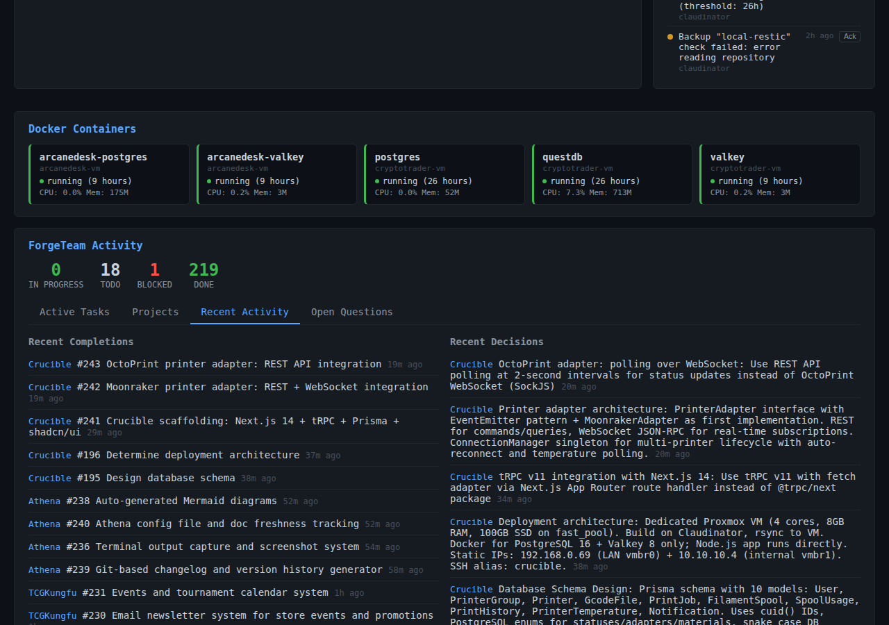

# Sentinel

## Table of Contents

- [Sentinel](#sentinel)
  - [What is this?](#what-is-this)
  - [Screenshots](#screenshots)
  - [Quick Start](#quick-start)
  - [How to Use](#how-to-use)
    - [Viewing Your Infrastructure](#viewing-your-infrastructure)
    - [Monitoring Active Work](#monitoring-active-work)
    - [Tracking Projects](#tracking-projects)
    - [Reviewing History](#reviewing-history)
    - [Managing Alerts](#managing-alerts)
    - [Restarting Containers](#restarting-containers)
  - [Features](#features)
  - [Installation](#installation)
    - [Prerequisites](#prerequisites)
    - [Detailed Setup](#detailed-setup)
    - [Running in Production](#running-in-production)
  - [Configuration](#configuration)
    - [Host Configuration](#host-configuration)
    - [Environment Variables](#environment-variables)
    - [Alert Thresholds](#alert-thresholds)
  - [Tech Stack](#tech-stack)
  - [License](#license)

Real-time infrastructure monitoring for your entire server fleet — see everything that's happening across all your VMs, Docker containers, and background tasks in one place.


## What is this?

Sentinel is a monitoring dashboard that watches over your infrastructure 24/7. Instead of SSHing into each server to check if things are running, you get a single web interface showing the health of all your hosts, containers, services, and automated tasks. It's designed for small teams running multiple VMs who need instant visibility without the complexity of enterprise monitoring tools.

## Screenshots


*The main dashboard gives you an at-a-glance view of all your infrastructure — host status, CPU/memory usage, and running containers*


*See what's currently running across your infrastructure — deployments, backups, and automated maintenance tasks*


*Track progress across all your projects with completion rates and task counts*


*A live feed of everything happening in your infrastructure — deployments, restarts, backups, and alerts*


*Track unresolved issues and questions that need attention across your projects*

## Quick Start

1. **Clone the repository**
   ```bash
   git clone <repository-url>
   cd sentinel
   ```

2. **Install dependencies**
   ```bash
   npm install
   ```

3. **Set up your configuration**
   ```bash
   cp config.example.json config.json
   # Edit config.json with your host details
   ```

4. **Start the server**
   ```bash
   npm start
   ```

5. **Open your browser**
   ```
   http://localhost:3000
   ```

That's it! The dashboard will start collecting metrics from your configured hosts immediately.

## How to Use

### Viewing Your Infrastructure

When you open Sentinel, the **main dashboard** shows you everything at once:
- **Host Status** panel lists all your VMs with their uptime and current state
- **System Metrics** displays live CPU, memory, and disk usage graphs
- **Container Overview** shows which Docker containers are running on each host

Click any host to drill down into detailed metrics and container logs.

### Monitoring Active Work

Switch to the **Active Tasks** tab to see what's currently happening:
- Running deployments and their progress
- Scheduled backup jobs
- Automated maintenance tasks
- Container restarts and health checks

Each task shows a real-time status indicator and elapsed time.

### Tracking Projects

The **Projects** tab gives you a birds-eye view of all ongoing work:
- See how many tasks are running vs. completed for each project
- Click a project to filter the activity feed
- Check completion percentages to spot bottlenecks

### Reviewing History

The **Recent Activity** feed is your infrastructure's event log:
- Every deployment, restart, backup, and alert is timestamied
- Filter by host, project, or event type
- Click any event to see full details and logs

### Managing Alerts

Sentinel automatically creates alerts when something needs your attention:
- Container crashes or failed health checks
- Disk space running low
- Services that have been down too long
- Failed backup jobs

Acknowledge alerts from the dashboard to track what you've addressed.

### Restarting Containers

Need to restart a container? Click the container name in the dashboard, then hit the **Restart** button. You can also enable **Auto-Restart** to automatically recover from crashes.

## Features

- **Real-time monitoring** — see updates as they happen, no page refresh needed
- **Multi-host management** — track dozens of VMs from a single dashboard
- **Container visibility** — know which Docker containers are running where
- **Task orchestration** — watch automated deployments and maintenance tasks
- **Smart alerting** — get notified when something actually needs your attention
- **Activity timeline** — complete audit log of infrastructure changes
- **SSH-based collection** — no agents to install on your servers
- **Backup tracking** — verify your backup jobs are running on schedule
- **One-click restarts** — quickly recover containers without SSHing

## Installation

### Prerequisites

- **Node.js** 18 or higher
- **SSH access** to the hosts you want to monitor
- **SSH keys** configured for passwordless login

### Detailed Setup

1. **Clone and install**
   ```bash
   git clone <repository-url>
   cd sentinel
   npm install
   ```

2. **Create your config file**
   ```bash
   cp config.example.json config.json
   ```

3. **Add your hosts to config.json**
   ```json
   {
     "hosts": [
       {
         "id": "web-01",
         "name": "Web Server 01",
         "hostname": "192.168.1.10",
         "port": 22,
         "username": "admin"
       }
     ]
   }
   ```

4. **Set up SSH keys**
   
   Sentinel needs passwordless SSH access to collect metrics:
   ```bash
   ssh-keygen -t ed25519 -f ~/.ssh/sentinel
   ssh-copy-id -i ~/.ssh/sentinel.pub admin@192.168.1.10
   ```

5. **Configure SSH key path**
   
   If using a non-default key location, set the environment variable:
   ```bash
   export SSH_KEY_PATH=~/.ssh/sentinel
   ```

6. **Start the server**
   ```bash
   npm start
   ```

   For development with auto-reload:
   ```bash
   npm run dev
   ```

7. **Verify it's working**
   
   Open http://localhost:3000/health — you should see `{"status":"ok"}`

### Running in Production

For production deployments, use a process manager like PM2:

```bash
npm install -g pm2
pm2 start src/server.js --name sentinel
pm2 save
pm2 startup
```

## Configuration

### Host Configuration

Each host in `config.json` supports these options:

```json
{
  "id": "unique-identifier",
  "name": "Human-friendly name",
  "hostname": "IP or domain",
  "port": 22,
  "username": "ssh-user",
  "tags": ["production", "web"],
  "checkInterval": 30
}
```

- `checkInterval`: How often to collect metrics (seconds, default: 30)
- `tags`: For filtering and grouping hosts in the dashboard

### Environment Variables

- `PORT` — Server port (default: 3000)
- `SSH_KEY_PATH` — Path to SSH private key (default: ~/.ssh/id_rsa)
- `DB_PATH` — SQLite database location (default: ./data/sentinel.db)
- `LOG_LEVEL` — Logging verbosity: error, warn, info, debug

### Alert Thresholds

Edit alert rules in `config.json`:

```json
{
  "alerts": {
    "cpu_threshold": 90,
    "memory_threshold": 85,
    "disk_threshold": 90,
    "container_down_minutes": 5
  }
}
```

## Tech Stack

- **Backend**: Express.js + Node.js
- **Database**: SQLite (better-sqlite3)
- **SSH**: ssh2 for remote metric collection
- **Scheduling**: node-cron for periodic checks
- **Frontend**: Vanilla JavaScript (no framework dependencies)

## License

Copyright © 2026, TheForge, LLC. All rights reserved.