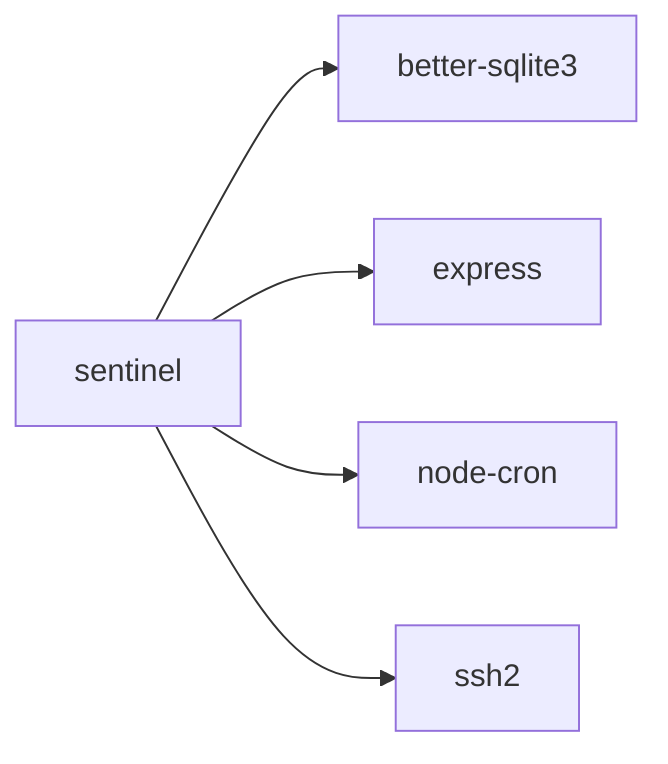
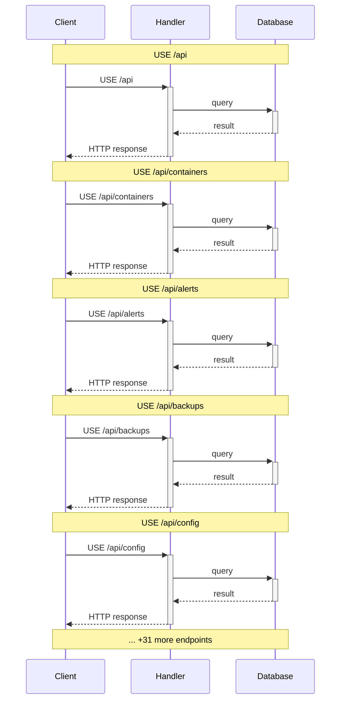

# sentinel - Architecture Diagrams

Generated by Athena v1.0.0 on 2026-02-10T09:12:03.593Z

**Framework:** express | **Language:** javascript

---

## Table of Contents

- [Package Dependencies](#package-dependencies)
- [API Request Flow](#api-request-flow)
- [File Structure](#file-structure)

## Package Dependencies

Runtime and development dependencies from package.json. Solid arrows = runtime deps, dashed = dev deps.

Mermaid source

---

## API Request Flow

Sequence diagram showing the request lifecycle through middleware and handlers.

Mermaid source

---

## File Structure

Directory tree of important project files and folders.

```mermaid
graph TD
  srv_forge_share_AI_Stuff_Sentinel["Sentinel (6)"]:::dir
  srv_forge_share_AI_Stuff_Sentinel_data["data (3)"]:::dir
  srv_forge_share_AI_Stuff_Sentinel --> srv_forge_share_AI_Stuff_Sentinel_data
  srv_forge_share_AI_Stuff_Sentinel_data_more["3 more files"]:::meta
  srv_forge_share_AI_Stuff_Sentinel_data --> srv_forge_share_AI_Stuff_Sentinel_data_more
  srv_forge_share_AI_Stuff_Sentinel_docs["docs (5)"]:::dir
  srv_forge_share_AI_Stuff_Sentinel --> srv_forge_share_AI_Stuff_Sentinel_docs
  srv_forge_share_AI_Stuff_Sentinel_docs_README_md["README.md"]:::file
  srv_forge_share_AI_Stuff_Sentinel_docs --> srv_forge_share_AI_Stuff_Sentinel_docs_README_md
  srv_forge_share_AI_Stuff_Sentinel_docs_more["4 more files"]:::meta
  srv_forge_share_AI_Stuff_Sentinel_docs --> srv_forge_share_AI_Stuff_Sentinel_docs_more
  srv_forge_share_AI_Stuff_Sentinel_public["public (1)"]:::dir
  srv_forge_share_AI_Stuff_Sentinel --> srv_forge_share_AI_Stuff_Sentinel_public
  srv_forge_share_AI_Stuff_Sentinel_public_more["1 more files"]:::meta
  srv_forge_share_AI_Stuff_Sentinel_public --> srv_forge_share_AI_Stuff_Sentinel_public_more
  srv_forge_share_AI_Stuff_Sentinel_src["src (6)"]:::dir
  srv_forge_share_AI_Stuff_Sentinel --> srv_forge_share_AI_Stuff_Sentinel_src
  srv_forge_share_AI_Stuff_Sentinel_src_alerts["alerts (2)"]:::dir
  srv_forge_share_AI_Stuff_Sentinel_src --> srv_forge_share_AI_Stuff_Sentinel_src_alerts
  srv_forge_share_AI_Stuff_Sentinel_src_alerts_more["2 more files"]:::meta
  srv_forge_share_AI_Stuff_Sentinel_src_alerts --> srv_forge_share_AI_Stuff_Sentinel_src_alerts_more
  srv_forge_share_AI_Stuff_Sentinel_src_collectors["collectors (4)"]:::dir
  srv_forge_share_AI_Stuff_Sentinel_src --> srv_forge_share_AI_Stuff_Sentinel_src_collectors
  srv_forge_share_AI_Stuff_Sentinel_src_collectors_index_js["index.js"]:::file
  srv_forge_share_AI_Stuff_Sentinel_src_collectors --> srv_forge_share_AI_Stuff_Sentinel_src_collectors_index_js
  srv_forge_share_AI_Stuff_Sentinel_src_collectors_more["3 more files"]:::meta
  srv_forge_share_AI_Stuff_Sentinel_src_collectors --> srv_forge_share_AI_Stuff_Sentinel_src_collectors_more
  srv_forge_share_AI_Stuff_Sentinel_src_db["db (1)"]:::dir
  srv_forge_share_AI_Stuff_Sentinel_src --> srv_forge_share_AI_Stuff_Sentinel_src_db
  srv_forge_share_AI_Stuff_Sentinel_src_db_index_js["index.js"]:::file
  srv_forge_share_AI_Stuff_Sentinel_src_db --> srv_forge_share_AI_Stuff_Sentinel_src_db_index_js
  srv_forge_share_AI_Stuff_Sentinel_src_routes["routes (8)"]:::dir
  srv_forge_share_AI_Stuff_Sentinel_src --> srv_forge_share_AI_Stuff_Sentinel_src_routes
  srv_forge_share_AI_Stuff_Sentinel_src_routes_more["8 more files"]:::meta
  srv_forge_share_AI_Stuff_Sentinel_src_routes --> srv_forge_share_AI_Stuff_Sentinel_src_routes_more
  srv_forge_share_AI_Stuff_Sentinel_src_server_js["server.js"]:::file
  srv_forge_share_AI_Stuff_Sentinel_src --> srv_forge_share_AI_Stuff_Sentinel_src_server_js
  srv_forge_share_AI_Stuff_Sentinel_src_more["5 more files"]:::meta
  srv_forge_share_AI_Stuff_Sentinel_src --> srv_forge_share_AI_Stuff_Sentinel_src_more
  srv_forge_share_AI_Stuff_Sentinel_CLAUDE_md["CLAUDE.md"]:::file
  srv_forge_share_AI_Stuff_Sentinel --> srv_forge_share_AI_Stuff_Sentinel_CLAUDE_md
  srv_forge_share_AI_Stuff_Sentinel_package_json["package.json"]:::file
  srv_forge_share_AI_Stuff_Sentinel --> srv_forge_share_AI_Stuff_Sentinel_package_json
  srv_forge_share_AI_Stuff_Sentinel_more["4 more files"]:::meta
  srv_forge_share_AI_Stuff_Sentinel --> srv_forge_share_AI_Stuff_Sentinel_more
  classDef dir fill:#e8f4f8,stroke:#2196F3,stroke-width:2px
  classDef file fill:#fff,stroke:#666
  classDef meta fill:#f5f5f5,stroke:#999,stroke-dasharray: 5 5
```

Mermaid source

---
